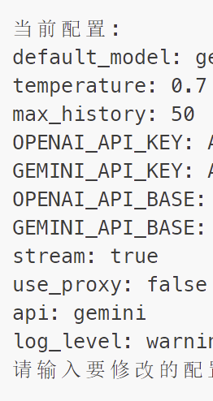

# README

# “do what jyy can do”

本项目是看到jyy酷炫的cli聊天工具后搞出来的

致谢@deepseek @claude

## feature

聊天模式：


管道模式


修改设置

​

## for user

不优雅地:

```
 python ag.py
```

优雅地:添加命令行函数

> 涉及路径的部分需要手动替换

linux:向~/.bashrc下添加

```
ag() {
    local pipe_content=""
    # 检查是否有管道输入
    if [ -p /dev/stdin ]; then
        # 收集所有管道输入
        pipe_content=$(cat -)

        local cmd_args=()

        # 添加 mode 参数（如果没有指定）
        local has_mode=false
        for arg in "$@"; do
            if [[ "$arg" == "-m" || "$arg" == "--mode" ]]; then
                has_mode=true
                break
            fi
        done
        if [ "$has_mode" = false ]; then
            cmd_args+=("-m")
            cmd_args+=("stdin")
        fi

        # 添加其他参数
        cmd_args+=("$@")

        # 添加 input 参数（如果没有指定）
        local has_input=false
        for ((i = 0; i < ${#cmd_args[@]}; i++)); do
            if [[ "${cmd_args[$i]}" == "-i" || "${cmd_args[$i]}" == "--input" ]]; then
                has_input=true
                break
            fi
        done
        if [ "$has_input" = false ]; then
            cmd_args+=("--input")
            cmd_args+=("$pipe_content")
        fi

        # 执行命令
        /path/to/python /path/to/ag.py "${cmd_args[@]}"
    else
        # 没有管道输入，直接传递参数
        /path/to/python /path/to/ag.py "$@"
    fi
}
```

windows：

打开配置文件

```python
notepad $PROFILE
```

将函数复制进去

```py
function ag {
    # 检查是否有管道输入
    if ($input.MoveNext()) {
        # 重置迭代器以便再次读取
        $input.Reset()
        
        # 收集所有管道输入
        $pipeContent = $input | Out-String
        
        # 准备命令行参数
        $cmdArgs = @()
        
        # 添加mode参数（如果没有指定）
        $hasMode = $false
        foreach ($arg in $args) {
            if ($arg -eq "-m" -or $arg -eq "--mode") {
                $hasMode = $true
                break
            }
        }
        if (-not $hasMode) {
            $cmdArgs += "-m"
            $cmdArgs += "stdin"
        }
        
        # 添加其他参数
        $cmdArgs += $args
        
        # 添加input参数（如果没有指定）
        $hasInput = $false
        for ($i = 0; $i -lt $cmdArgs.Count; $i++) {
            if ($cmdArgs[$i] -eq "-i" -or $cmdArgs[$i] -eq "--input") {
                $hasInput = $true
                break
            }
        }
        if (-not $hasInput) {
            $cmdArgs += "--input"
            $cmdArgs += $pipeContent
        }
        
        # 执行命令
        $pythonCmd = "C:\Develop\miniconda3\python.exe"
        $scriptPath = "C:\Develop\common\ag_cli\ag.py"
        & $pythonCmd $scriptPath $cmdArgs
    } else {
        # 没有管道输入，直接传递参数
        C:\Develop\miniconda3\python.exe C:\Develop\common\ag_cli\ag.py $args
    }
}
```

启动

```py
.$PROFILE
```

## for developer

1. **添加新模式的步骤**：

```python
 # 新建 src/modes/text.py
 from src.modes import register_mode
 
 @register_mode("text")
 def handle_text(client, model):
     """文本批处理模式"""
     # 实现文本处理逻辑
     pass
```

2. **添加新参数的步骤**：

```python
 # 修改 src/cli.py
 def parse_args():
     parser = argparse.ArgumentParser(...)
     # 添加新参数
     parser.add_argument("--input-file", help="输入文件路径")
     return parser.parse_args()
```

## 计划

#### 高优先级

* [X] 流式输出
* [X] 添加日志
* [X] 保存对话历史
* [ ] 文档对话
* [ ] 多模态
* [ ] 多轮对话（逻辑设计，实现）
* [X] 管道模式：使用管道传入文本
* [X] cli端修改api与url,设置代理

  <div class="siyuan-plugin-task-date-info-wrapper" contenteditable="false" data-type="siyuan-plugin-custom-wrapper" style="position: absolute; top: 0px; right: 0px; left: 0px; pointer-events: none !important;"><div class="siyuan-plugin-task-date-info" contenteditable="false" data-editable="false" spellcheck="false" data-type="siyuan-plugin-custom-date-info" style="position: absolute; font-size: 10px; color: rgb(136, 136, 136); text-align: right; right: 20px; top: -12px; pointer-events: none !important; user-select: none !important;">完成时间: 2025-04-24</div></div>

  <div class="siyuan-plugin-task-date-info-wrapper" contenteditable="false" data-type="siyuan-plugin-custom-wrapper" style="position: absolute; top: 0px; right: 0px; left: 0px; pointer-events: none !important;"><div class="siyuan-plugin-task-date-info" contenteditable="false" data-editable="false" spellcheck="false" data-type="siyuan-plugin-custom-date-info" style="position: absolute; font-size: 10px; color: rgb(136, 136, 136); text-align: right; right: 20px; top: -12px; pointer-events: none !important; user-select: none !important;">完成时间: 2025-03-06</div></div>

#### 低优先级

* [X] 细化错误处理，完善log系统

  <div class="siyuan-plugin-task-date-info-wrapper" contenteditable="false" data-type="siyuan-plugin-custom-wrapper" style="position: absolute; top: 0px; right: 0px; left: 0px; pointer-events: none !important;"><div class="siyuan-plugin-task-date-info" contenteditable="false" data-editable="false" spellcheck="false" data-type="siyuan-plugin-custom-date-info" style="position: absolute; font-size: 10px; color: rgb(136, 136, 136); text-align: right; right: 20px; top: -12px; pointer-events: none !important; user-select: none !important;">完成时间: 2025-04-24</div></div>
* [ ] 优化setting交互

#### bug

* [X] log有时候会存在文件占用导致写失败

‍
